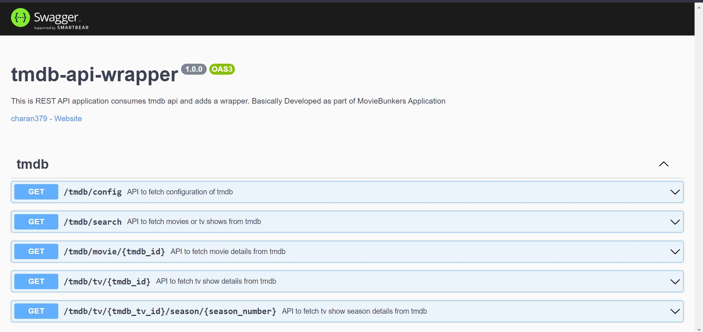

# tmdb-api-wrapper :clapper:

[](https://github.com/charan379/tmdb-api-wrapper)    [](https://github.com/charan379/tmdb-api-wrapper) [](https://www.gnu.org/licenses/agpl-3.0.en.html)

This is REST API application consumes tmdb api and adds a wrapper. Basically Developed as part of MovieBunkers Application


## Environment Variables

To run this project, you will need to add the following environment variables to your .env file

`APP_TMDB_API`  
`APP_TMDB_API_URL`  
`APP_TMDB_API_IMAGES_URL`  
`APP_TMDB_API_LANGUAGE`  
`APP_TMDB_API_REGION`  
`PORT`  


####  Example 
`APP_TMDB_API`=1010cbcbe48**********************  
`APP_TMDB_API_URL`=https://api.themoviedb.org/3/  
`APP_TMDB_API_IMAGES_URL`=https://image.tmdb.org/t/p/  
`APP_TMDB_API_LANGUAGE`=en-US  
`APP_TMDB_API_REGION`=IN  
`PORT`=3000 

## Run

Clone the project

```bash
  git clone https://github.com/charan379/tmdb-api-wrapper.git
```

Go to the project directory

```bash
  cd tmdb-api-wrapper
```
Add Environment Variables then
Install dependencies

```bash
  npm install
```

Start the server

```bash
  npm run start
```

Server will start running on given port

## Supported API END Points
#### Following is the list of supports API End points by [tmdb-api-wrapper](https://github.com/charan379/tmdb-api-wrapper)

| Name | API END Point     | Example | Status   |
| :------------------------------------- | :--------------- | :------------| :------- |
| `search` | `GET` [`/tmdb/search`](#get-search) | ```/tmdb/search?query=fight%20club&type=movie&year=1999&pageNo=1``` | **:green_circle:** |
| `movieDetails` | `GET` [`/tmdb/movie/{tmdb_id}`](#get-movie-details) | ```/tmdb/movie/550``` | **:green_circle:** |
| `tvDetails` | `GET` [`/tmdb/tv/{tmdb_id}`](#get-tv-details) | ```/tmdb/tv/1399``` | **:green_circle:** |
| `tvSeasonDetails` | `GET` [`/tmdb/tv/{tmdb_tv_id}/season/{season_number}`](#get-tv-show-season-details-from-tmdb) | ```tmdb/tv/1399/season/1``` | **:green_circle:** |

## API Reference

### GET Search
#### Retirve a list of movies or tv shows from tmdb

```bash
  GET /tmdb/search
```

| Query Parameter | Type     | Description                |
| :-------- | :------- | :------------------------- |
| `query` | `string` | **Required**. movie or tv name |
| `type` | `string` | **Required**. movie or tv |
| `year` | `number` | release year |
| `pageNo` | `string` | page number |

#### Example
```bash
  GET /tmdb/search?query=fight%20club&type=movie&year=1999&pageNo=1
```
### GET movie details
#### Retirve movie details from tmdb

```bash
  GET /tmdb/movie/{tmdb_id}
```

| Path Parameter | Type     | Description                       |
| :-------- | :------- | :-------------------------------- |
| `tmdb_id`      | `number` | **Required**. Id of movie to fetch |

#### Example
```bash
  GET /tmdb/movie/550
```

### GET tv details
#### Retirve tv details from tmdb

```bash
  GET /tmdb/tv/{tmdb_id}
```

| Path Parameter | Type     | Description                       |
| :-------- | :------- | :-------------------------------- |
| `tmdb_id`      | `number` | **Required**. Id of tv to fetch |

#### Example
```bash
  GET /tmdb/tv/1399
```

### GET tv show season details from tmdb
#### Retirve tv show season details from tmdb

```bash
  GET /tmdb/tv/{tmdb_tv_id}/season/{season_number}
```

| Path Parameter | Type     | Description                       |
| :-------- | :------- | :-------------------------------- |
| `tmdb_tv_id`      | `number` | **Required**. Id of tv to fetch |
| `season_number`      | `number` | **Required**. season number of tv to fetch |

#### Example
```bash
  GET /tmdb/tv/1399/season/1
```

### Post-Installation
#### Swagger Documentation
```bash
    http://localhost:PORT/api-docs
````


## Authors

- [@charan379](https://www.github.com/charan379)

## License

 [](https://www.gnu.org/licenses/agpl-3.0.en.html)
